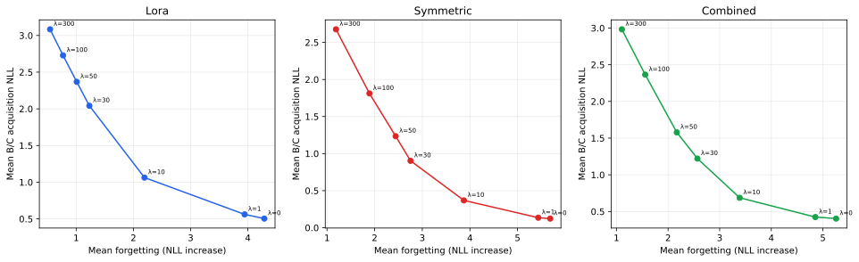
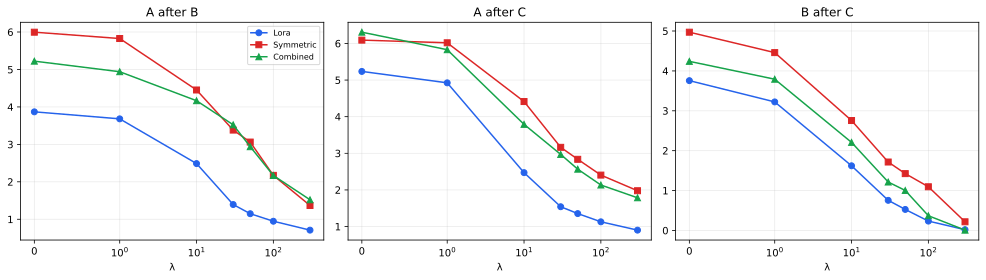
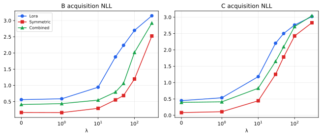
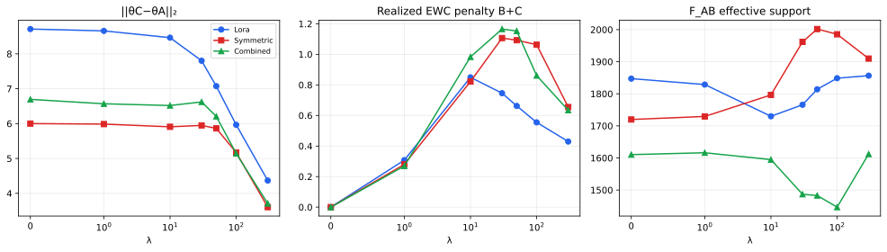

# EWC Lambda Sweep: Deep Scientific Analysis

## 1. Executive summary

This single-seed exploratory sweep isolates EWC strength under one matched execution path. Across all three adapters, increasing λ reduces forgetting and increases new-fact acquisition NLL. The transition is gradual rather than binary, and the useful compromise region differs by architecture.

- A 10% operational threshold shows that forgetting first decreases materially at **λ=10 for all three methods**.
- LoRA begins paying a material acquisition cost by **λ=1**; Symmetric and Combined cross the same 10% threshold at **λ=10**.
- LoRA’s two geometric knee methods both select **λ=10**. Symmetric’s both select **λ=30**. Combined selects **λ=30** by ideal distance and **λ=10** by endpoint-chord curvature.
- Exact match begins falling before it reaches zero. It becomes zero at λ=30 for LoRA and Symmetric, and at λ=50 for Combined.
- λ=100 and λ=300 consistently under-learn B/C under this protocol; they improve stability while substantially weakening acquisition and greedy exact generation.
- No Combined point at a shared λ dominates both LoRA and Symmetric simultaneously in forgetting and acquisition.

The recommended confirmation candidates are LoRA {1,10}, Symmetric {10,30}, and Combined {10,30}. They are candidate-generating choices, not statistically optimal values.

## 2. Experimental scope

The sweep contains 21 runs: LoRA, Symmetric, and Combined at λ ∈ {0,1,10,30,50,100,300}, seed 42. Each run uses the same frozen GPT-2 Small backbone, block-0 `attn.c_proj`, 12 facts per A/B/C set, 2,500 steps per phase, and no replay. Every adapter has 6,144 trainable parameters.

The objective is

$$L_{\mathrm{total}}=L_{\mathrm{current}}+\frac{\lambda}{2}\sum_i F_i(\theta_i-\theta_i^*)^2,$$

with online Fisher update

$$F_{AB}=\gamma F_A+F_B,\qquad \gamma=1.$$

Lambda controls resistance to changing parameters judged important for earlier facts.

## 3. Why λ=0 is the primary control

Lambda zero executes the same EWC runner, microbatch 4, accumulation 1, tokenization, ordering, Fisher estimation, checkpointing, and random-seed path as every other sweep cell. Fisher and references are still computed, while multiplication by λ makes the regularization objective and gradient contribution exactly zero. This is the primary numerical baseline. Historical microbatch-1 sequential results are excluded from the primary analysis.

## 4. Stability–plasticity trade-off

Every sampled λ is Pareto-nondominated within its own method because each increase in stability is purchased with reduced plasticity. Pareto membership therefore does not identify a unique choice. The knee diagnostics and exact-match behavior provide additional descriptive constraints.

## 5. LoRA analysis

LoRA moves from mean forgetting 4.2868 at λ=0 to 2.1935 at λ=10, while mean B/C acquisition NLL rises from 0.5044 to 1.0628. λ=1 retains the λ=0 final exact match (0.0833) with a modest stability gain. At λ=10 exact match remains non-zero (0.0139), but at λ=30 it collapses to zero. Both knee methods select λ=10. LoRA therefore reacts strongly to relatively weak regularization and does not require λ=30–50 to preserve facts.

## 6. Symmetric analysis

Symmetric starts with the strongest plasticity: mean acquisition NLL 0.1232 and final exact match 0.3333 at λ=0. At λ=10 it retains non-zero exact match (0.1250) while reducing mean forgetting from 5.6856 to 3.8739. λ=30 minimizes both geometric compromise diagnostics and final mean NLL (2.3002), but exact match is already zero. λ=50 adds stability with worse acquisition and no exact-match recovery. The useful candidates are therefore λ=10 for retained generation and λ=30 for balanced NLL.

## 7. Combined analysis

Combined reduces mean forgetting from 5.2562 at λ=0 to 3.3880 at λ=10 and 2.5690 at λ=30. The endpoint-chord knee selects λ=10, while normalized ideal distance selects λ=30. Exact match remains small but non-zero at λ=30 (0.0139) and reaches zero at λ=50. Across shared λ values, Combined never has both lower forgetting and lower acquisition NLL than both LoRA and Symmetric. This sweep therefore provides no evidence of synergy in the primary trade-off plane.

## 8. Cross-method comparison

| lambda | method | mean_forgetting | mean_new_fact_acquisition_nll | final_mean_nll | final_mean_probability | final_mean_exact_match | best_stability | best_plasticity | best_final_nll | best_probability | best_exact_match |
| --- | --- | --- | --- | --- | --- | --- | --- | --- | --- | --- | --- |
| 0.0000 | combined | 5.2562 | 0.4037 | 3.9544 | 0.2333 | 0.0694 | False | False | False | False | False |
| 1.0000 | combined | 4.8535 | 0.4242 | 3.6594 | 0.2328 | 0.0556 | False | False | False | False | False |
| 10.0000 | combined | 3.3880 | 0.6870 | 2.6272 | 0.1829 | 0.0278 | False | False | False | False | False |
| 30.0000 | combined | 2.5690 | 1.2213 | 2.3786 | 0.1280 | 0.0139 | False | False | False | False | True |
| 50.0000 | combined | 2.1691 | 1.5783 | 2.4115 | 0.1034 | 0.0000 | False | False | False | False | True |
| 100.0000 | combined | 1.5572 | 2.3648 | 2.5806 | 0.0784 | 0.0000 | False | False | False | False | True |
| 300.0000 | combined | 1.1045 | 2.9827 | 2.7557 | 0.0698 | 0.0000 | False | False | False | False | True |
| 0.0000 | lora | 4.2868 | 0.5044 | 3.7514 | 0.2281 | 0.0833 | True | False | True | False | False |
| 1.0000 | lora | 3.9427 | 0.5614 | 3.5078 | 0.2147 | 0.0833 | True | False | True | False | False |
| 10.0000 | lora | 2.1935 | 1.0628 | 2.4909 | 0.1504 | 0.0139 | True | False | True | False | False |
| 30.0000 | lora | 1.2300 | 2.0419 | 2.5446 | 0.0876 | 0.0000 | True | False | False | False | False |
| 50.0000 | lora | 1.0098 | 2.3680 | 2.6236 | 0.0779 | 0.0000 | True | False | False | False | True |
| 100.0000 | lora | 0.7705 | 2.7284 | 2.6915 | 0.0731 | 0.0000 | True | False | False | False | True |
| 300.0000 | lora | 0.5436 | 3.0840 | 2.7808 | 0.0729 | 0.0000 | True | False | False | False | True |
| 0.0000 | symmetric | 5.6856 | 0.1232 | 3.8413 | 0.3119 | 0.3333 | False | True | False | True | True |
| 1.0000 | symmetric | 5.4343 | 0.1352 | 3.6543 | 0.3060 | 0.2917 | False | True | False | True | True |
| 10.0000 | symmetric | 3.8739 | 0.3682 | 2.7072 | 0.2442 | 0.1250 | False | True | False | True | True |
| 30.0000 | symmetric | 2.7536 | 0.9028 | 2.3002 | 0.1550 | 0.0000 | False | True | True | True | False |
| 50.0000 | symmetric | 2.4409 | 1.2347 | 2.3154 | 0.1204 | 0.0000 | False | True | True | True | True |
| 100.0000 | symmetric | 1.8908 | 1.8116 | 2.4464 | 0.0949 | 0.0000 | False | True | True | True | True |
| 300.0000 | symmetric | 1.1878 | 2.6767 | 2.5882 | 0.0817 | 0.0000 | False | True | True | True | True |

The metric-specific best method varies. LoRA generally leads stability, Symmetric generally leads plasticity and probability, and Combined occupies intermediate regions. No single winner is supported.

## 9. Exact-match collapse

| method | lambda0_exact_match | first_lambda_with_decline | first_lambda_with_zero_exact_match | lambda30_exact_match | lambda50_exact_match |
| --- | --- | --- | --- | --- | --- |
| combined | 0.0694 | 1.0000 | 50.0000 | 0.0139 | 0.0000 |
| lora | 0.0833 | 10.0000 | 30.0000 | 0.0000 | 0.0000 |
| symmetric | 0.3333 | 1.0000 | 30.0000 | 0.0000 | 0.0000 |

Lambda 30 preserves only a small Combined exact-match signal and none for LoRA or Symmetric. Lambda 50 preserves none for any method. This makes λ=30/50 unsuitable if greedy exact generation is a hard requirement, despite favorable balanced NLL near λ=30.

## 10. Parameter movement

- **Combined:** A→C displacement decreases in 5/6 adjacent λ transitions; displacement–forgetting Pearson r=0.747, Spearman ρ=0.893.
- **Lora:** A→C displacement decreases in 6/6 adjacent λ transitions; displacement–forgetting Pearson r=0.787, Spearman ρ=1.000.
- **Symmetric:** A→C displacement decreases in 5/6 adjacent λ transitions; displacement–forgetting Pearson r=0.693, Spearman ρ=0.964.

Movement is broadly reduced at high λ but is not perfectly monotonic at low/intermediate λ. Fisher weighting constrains selected directions rather than ordinary Euclidean distance uniformly.

## 11. Fisher structure

F_A is identical across λ within each method because phase A precedes the EWC penalty and uses the same execution path. F_AB varies because λ affects phase-B learning and therefore the B Fisher estimate. Output factors carry most Fisher mass. Cross-architecture Fisher magnitudes are parameterization dependent and should not be ranked as a universal importance scale. The observed association between Fisher concentration and lambda response is mechanistic evidence, not causal proof.

## 12. Pareto analysis

| method | lambda | mean_forgetting | mean_new_fact_acquisition_nll | final_mean_nll | final_mean_probability | final_mean_exact_match |
| --- | --- | --- | --- | --- | --- | --- |
| combined | 0.0000 | 5.2562 | 0.4037 | 3.9544 | 0.2333 | 0.0694 |
| combined | 1.0000 | 4.8535 | 0.4242 | 3.6594 | 0.2328 | 0.0556 |
| combined | 10.0000 | 3.3880 | 0.6870 | 2.6272 | 0.1829 | 0.0278 |
| combined | 30.0000 | 2.5690 | 1.2213 | 2.3786 | 0.1280 | 0.0139 |
| combined | 50.0000 | 2.1691 | 1.5783 | 2.4115 | 0.1034 | 0.0000 |
| combined | 100.0000 | 1.5572 | 2.3648 | 2.5806 | 0.0784 | 0.0000 |
| combined | 300.0000 | 1.1045 | 2.9827 | 2.7557 | 0.0698 | 0.0000 |
| lora | 0.0000 | 4.2868 | 0.5044 | 3.7514 | 0.2281 | 0.0833 |
| lora | 1.0000 | 3.9427 | 0.5614 | 3.5078 | 0.2147 | 0.0833 |
| lora | 10.0000 | 2.1935 | 1.0628 | 2.4909 | 0.1504 | 0.0139 |
| lora | 30.0000 | 1.2300 | 2.0419 | 2.5446 | 0.0876 | 0.0000 |
| lora | 50.0000 | 1.0098 | 2.3680 | 2.6236 | 0.0779 | 0.0000 |
| lora | 100.0000 | 0.7705 | 2.7284 | 2.6915 | 0.0731 | 0.0000 |
| lora | 300.0000 | 0.5436 | 3.0840 | 2.7808 | 0.0729 | 0.0000 |
| symmetric | 0.0000 | 5.6856 | 0.1232 | 3.8413 | 0.3119 | 0.3333 |
| symmetric | 1.0000 | 5.4343 | 0.1352 | 3.6543 | 0.3060 | 0.2917 |
| symmetric | 10.0000 | 3.8739 | 0.3682 | 2.7072 | 0.2442 | 0.1250 |
| symmetric | 30.0000 | 2.7536 | 0.9028 | 2.3002 | 0.1550 | 0.0000 |
| symmetric | 50.0000 | 2.4409 | 1.2347 | 2.3154 | 0.1204 | 0.0000 |
| symmetric | 100.0000 | 1.8908 | 1.8116 | 2.4464 | 0.0949 | 0.0000 |
| symmetric | 300.0000 | 1.1878 | 2.6767 | 2.5882 | 0.0817 | 0.0000 |

All within-method points are nondominated on the sampled grid. The knee table therefore supplies a descriptive compromise rather than an optimum:

| method | lambda | normalized_ideal_distance | endpoint_chord_distance | ideal_distance_candidate | chord_knee_candidate |
| --- | --- | --- | --- | --- | --- |
| combined | 0.0000 | 1.0000 | 0.0000 | False | False |
| combined | 1.0000 | 0.9030 | 0.0630 | False | False |
| combined | 10.0000 | 0.5609 | 0.2405 | False | True |
| combined | 30.0000 | 0.4743 | 0.2335 | True | False |
| combined | 50.0000 | 0.5227 | 0.2037 | False | False |
| combined | 100.0000 | 0.7682 | 0.0923 | False | False |
| combined | 300.0000 | 1.0000 | 0.0000 | False | False |
| lora | 0.0000 | 1.0000 | 0.0000 | False | False |
| lora | 1.0000 | 0.9083 | 0.0494 | False | False |
| lora | 10.0000 | 0.4911 | 0.2424 | True | True |
| lora | 30.0000 | 0.6236 | 0.1560 | False | False |
| lora | 50.0000 | 0.7331 | 0.1082 | False | False |
| lora | 100.0000 | 0.8643 | 0.0546 | False | False |
| lora | 300.0000 | 1.0000 | 0.0000 | False | False |
| symmetric | 0.0000 | 1.0000 | 0.0000 | False | False |
| symmetric | 1.0000 | 0.9441 | 0.0362 | False | False |
| symmetric | 10.0000 | 0.6049 | 0.2170 | False | False |
| symmetric | 30.0000 | 0.4630 | 0.2451 | True | True |
| symmetric | 50.0000 | 0.5168 | 0.2023 | False | False |
| symmetric | 100.0000 | 0.6794 | 0.1290 | False | False |
| symmetric | 300.0000 | 1.0000 | 0.0000 | False | False |

## 13. Candidate lambda values

| method | lambda | mean_forgetting | mean_new_fact_acquisition_nll | final_mean_nll | final_mean_probability | final_mean_exact_match | rationale |
| --- | --- | --- | --- | --- | --- | --- | --- |
| combined | 10.0000 | 3.3880 | 0.6870 | 2.6272 | 0.1829 | 0.0278 | maximum endpoint-chord knee distance; non-zero final exact match; Pareto-nondominated |
| combined | 30.0000 | 2.5690 | 1.2213 | 2.3786 | 0.1280 | 0.0139 | minimum normalized distance to ideal; non-zero final exact match; Pareto-nondominated |
| lora | 1.0000 | 3.9427 | 0.5614 | 3.5078 | 0.2147 | 0.0833 | non-zero final exact match; Pareto-nondominated |
| lora | 10.0000 | 2.1935 | 1.0628 | 2.4909 | 0.1504 | 0.0139 | minimum normalized distance to ideal; maximum endpoint-chord knee distance; non-zero final exact match; Pareto-nondominated |
| symmetric | 10.0000 | 3.8739 | 0.3682 | 2.7072 | 0.2442 | 0.1250 | non-zero final exact match; Pareto-nondominated |
| symmetric | 30.0000 | 2.7536 | 0.9028 | 2.3002 | 0.1550 | 0.0000 | minimum normalized distance to ideal; maximum endpoint-chord knee distance; Pareto-nondominated |

The focused λ=0/10/30/50/100 comparison is available in `tables/LAMBDA_30_50_COMPARISON.csv`. λ=100 and λ=300 are useful stability anchors but are too restrictive for exact generation in this experiment.

## 14. Limitations

- One seed; no confidence intervals or inferential claims are justified.
- One synthetic dataset, one GPT-2 model size, and one insertion point.
- The diagonal empirical Fisher omits parameter correlations.
- Candidate knees depend on the sampled λ grid and metric normalization.
- Exact match is a strict greedy-decoding metric and complements rather than replaces NLL.
- Fisher magnitudes are parameterization dependent.

## 15. Confirmation experiment recommendation

- **LoRA:** λ=1 and λ=10. λ=1 preserves baseline exact match; λ=10 is the common geometric knee.
- **Symmetric:** λ=10 and λ=30. λ=10 retains useful exact match; λ=30 is the balanced-NLL knee.
- **Combined:** λ=10 and λ=30. They are the two independent knee candidates, with λ=30 remaining just above zero exact match.

A future confirmation should use seeds 42, 123, and 456 under this exact execution path. It should retain λ=0 as the common matched control.

## 16. Publication-oriented conclusions

EWC strength continuously controls factual-memory stability and new-fact plasticity. Moderate regularization provides useful compromises, but the transition differs by adapter architecture. LoRA responds at lower λ, while Symmetric and Combined retain stronger acquisition into the λ=10–30 range. High λ suppresses forgetting but causes under-learning and loss of exact generation. These single-seed findings nominate method-specific confirmation values; they do not identify universal optimal regularization.

## Descriptive correlations

| method | x | y | pearson_r | spearman_rho | n |
| --- | --- | --- | --- | --- | --- |
| combined | lambda | mean_forgetting | -0.7358 | -1.0000 | 7 |
| combined | lambda | mean_new_fact_acquisition_nll | 0.8992 | 1.0000 | 7 |
| combined | lambda | total_parameter_displacement_a_c_l2 | -0.9769 | -0.8929 | 7 |
| combined | total_parameter_displacement_a_c_l2 | mean_forgetting | 0.7471 | 0.8929 | 7 |
| combined | realized_ewc_penalty_c | mean_forgetting | -0.4043 | -0.2857 | 7 |
| combined | realized_ewc_penalty_c | mean_new_fact_acquisition_nll | 0.0287 | 0.2857 | 7 |
| lora | lambda | mean_forgetting | -0.6321 | -1.0000 | 7 |
| lora | lambda | mean_new_fact_acquisition_nll | 0.7717 | 1.0000 | 7 |
| lora | lambda | total_parameter_displacement_a_c_l2 | -0.9478 | -1.0000 | 7 |
| lora | total_parameter_displacement_a_c_l2 | mean_forgetting | 0.7873 | 1.0000 | 7 |
| lora | realized_ewc_penalty_c | mean_forgetting | -0.4391 | -0.1071 | 7 |
| lora | realized_ewc_penalty_c | mean_new_fact_acquisition_nll | 0.1581 | 0.1071 | 7 |
| symmetric | lambda | mean_forgetting | -0.7502 | -1.0000 | 7 |
| symmetric | lambda | mean_new_fact_acquisition_nll | 0.9267 | 1.0000 | 7 |
| symmetric | lambda | total_parameter_displacement_a_c_l2 | -0.9915 | -0.9643 | 7 |
| symmetric | total_parameter_displacement_a_c_l2 | mean_forgetting | 0.6930 | 0.9643 | 7 |
| symmetric | realized_ewc_penalty_c | mean_forgetting | -0.5507 | -0.3929 | 7 |
| symmetric | realized_ewc_penalty_c | mean_new_fact_acquisition_nll | 0.1904 | 0.3929 | 7 |
