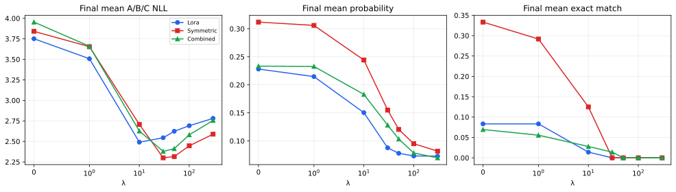

# EWC Strength and Continual Factual Adaptation

## Research question

How does online EWC strength control the stability–plasticity trade-off for LoRA, Symmetric, and Combined adapters when execution, parameter count, data, and seed are held fixed?

## Mathematical formulation

$$L_{\mathrm{total}}=L_{\mathrm{current}}+\frac{\lambda}{2}\sum_iF_i(\theta_i-\theta_i^*)^2,$$
$$F_{AB}=F_A+F_B.$$

## Protocol

Frozen GPT-2 Small; block-0 `attn.c_proj`; 6,144 trainable adapter parameters; 12 facts per A/B/C set; no replay; 2,500 steps per phase; seed 42; λ ∈ {0,1,10,30,50,100,300}. Lambda zero uses the same EWC execution path and is the primary control.

## Strongest findings

1. Forgetting first decreases materially at λ=10 for all methods under a predeclared 10% threshold.
2. LoRA reacts at lower λ; λ=10 is its geometric knee. Symmetric and Combined have compromise candidates near λ=10–30.
3. Exact match becomes zero at λ=30 for LoRA and Symmetric and at λ=50 for Combined.
4. Very high λ reduces forgetting but causes clear B/C under-learning.
5. Combined does not dominate both LoRA and Symmetric in the forgetting–acquisition plane.

## Principal figures

## Candidate conclusion

Online EWC exposes a method-dependent continuum rather than one optimal regularization strength. Moderate λ values can reduce catastrophic forgetting while retaining some acquisition, whereas λ≥100 is overly restrictive for exact generation in this configuration.

## Limitations

The sweep uses one seed and one synthetic GPT-2 configuration. Knee and Pareto results are descriptive and grid dependent. No statistical significance or universal optimum is claimed.

## Recommended confirmation

Run λ={1,10} for LoRA and λ={10,30} for Symmetric and Combined across seeds 42, 123, and 456, retaining λ=0 as the matched control.
