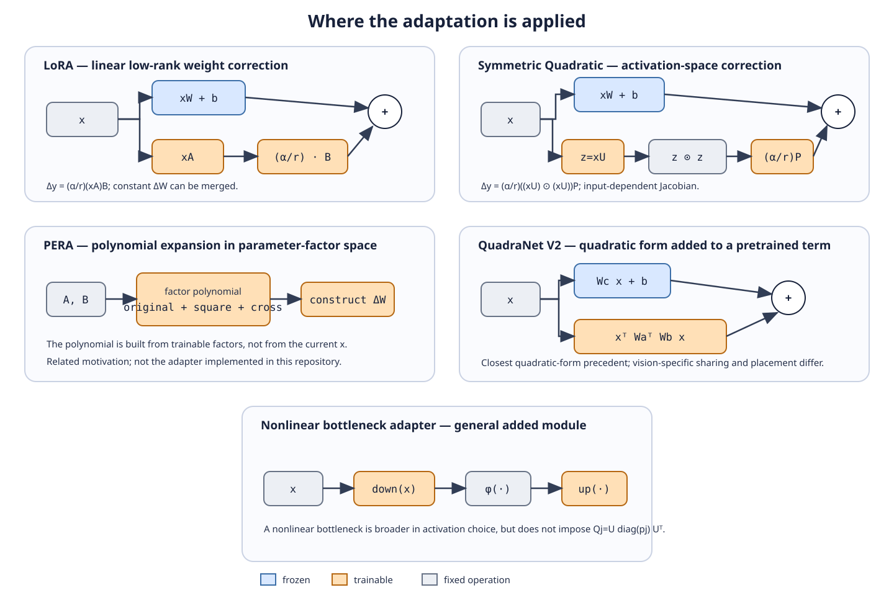

# Architecture comparison

The original vector diagram below summarizes signal flow. Blue boxes are
frozen, orange boxes are trainable, and grey boxes are fixed operations. It is
an original schematic based on the cited equations and does not reproduce a
third-party figure.

- **LoRA:** low-rank linear branch added to a frozen projection.
- **Symmetric Quadratic:** project, square elementwise, project to output, add.
- **PERA:** polynomial manipulation is applied to low-rank parameter factors;
  the constructed weight update then acts linearly on the activation.
- **QuadraNet V2:** pretrained first-order output plus a factored quadratic
  form, in its published vision-oriented framework.
- **Nonlinear bottleneck adapter:** down-project, apply a nonlinear activation,
  up-project, and add; no symmetric quadratic constraint is implied.
