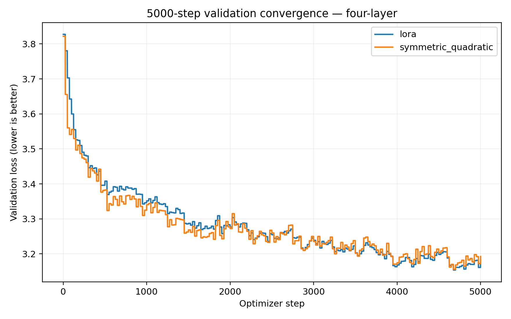
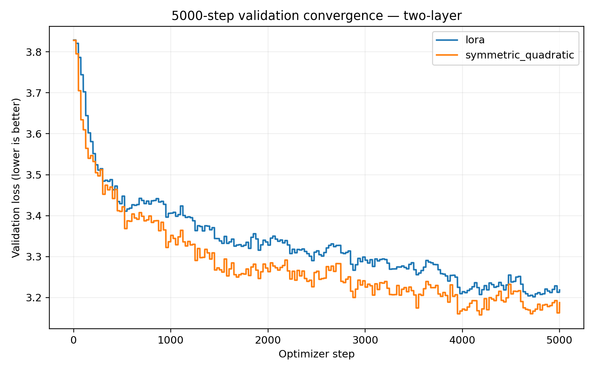
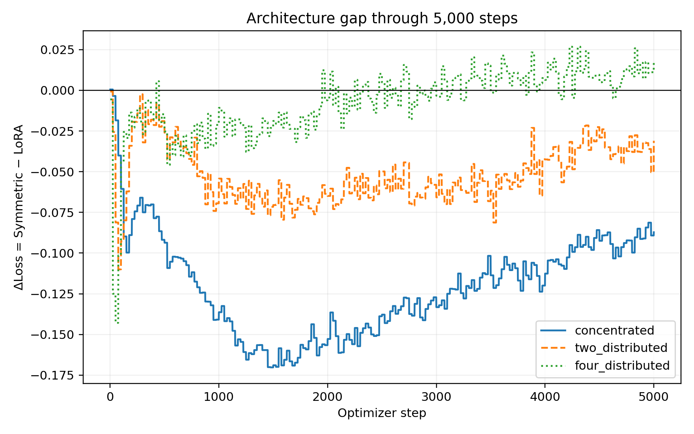
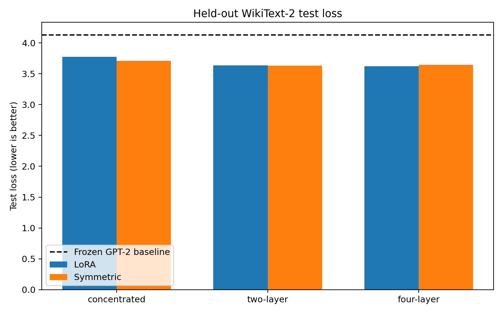
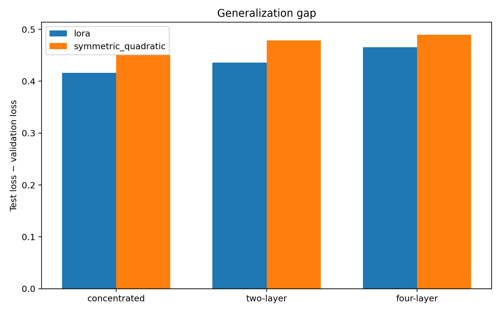

# Long Convergence and Held-out Test Study

**Author:** Federico Lolli  
**Contact:** xxlilloxx@gmail.com

## Executive summary

This study extends the fixed-budget 12,288-parameter comparison from 2,000 to 5,000 optimizer steps. It includes LoRA and Symmetric Quadratic in concentrated, two-layer, and four-layer geometries, with seeds 42, 123, and 456: 18/18 valid runs. Adapter-only checkpoints were saved at steps 1000, 2000, 3000, 4000, and 5000, and a reload smoke test reproduced logits with maximum absolute error 0.0.

The final checkpoint at step 5000 was chosen before looking at the public test set. Test evaluation used the same concatenation, GPT-2 tokenization, and 128-token block construction as validation, with no gradient updates. The full row-level results are in `long_results.csv`; aggregates are in `aggregate_long.csv`.

## Protocol and checkpointing

The backbone is GPT-2 Small with frozen weights. Adapter parameters are FP32 while the backbone runs in FP16 autocast. Training uses WikiText-2, sequence length 128, batch size 1, accumulation 4, AdamW at 3e-4, and gradient clipping 1.0. Each run writes `config.json`, `metrics.csv`, `summary.json`, `run.log`, and adapter-only checkpoint files. Checkpoints contain adapter state and metadata; they do not duplicate GPT-2 weights.

## Validation results at step 5000

| Geometry | Model | Val loss mean ± SD | PPL mean ± SD | AULC | Time s | Tokens/s | Test loss mean ± SD | Test PPL mean ± SD | Gap mean ± SD |
|---|---|---:|---:|---:|---:|---:|---:|---:|---:|
| concentrated | lora | 3.3577 ± 0.0041 | 28.72 ± 0.12 | 3.4898 | 766.0 | 3342 | 3.7741 ± 0.0022 | 43.56 ± 0.10 | 0.4164 ± 0.0023 |
| concentrated | symmetric_quadratic | 3.2559 ± 0.0048 | 25.94 ± 0.12 | 3.3691 | 769.4 | 3327 | 3.7067 ± 0.0060 | 40.72 ± 0.24 | 0.4508 ± 0.0082 |
| two_distributed | lora | 3.2003 ± 0.0178 | 24.54 ± 0.44 | 3.3340 | 791.4 | 3235 | 3.6361 ± 0.0075 | 37.95 ± 0.29 | 0.4358 ± 0.0103 |
| two_distributed | symmetric_quadratic | 3.1520 ± 0.0126 | 23.38 ± 0.30 | 3.2822 | 800.3 | 3199 | 3.6306 ± 0.0025 | 37.74 ± 0.09 | 0.4787 ± 0.0131 |
| four_distributed | lora | 3.1537 ± 0.0204 | 23.43 ± 0.48 | 3.2812 | 835.1 | 3065 | 3.6192 ± 0.0115 | 37.31 ± 0.43 | 0.4655 ± 0.0109 |
| four_distributed | symmetric_quadratic | 3.1557 ± 0.0320 | 23.48 ± 0.74 | 3.2735 | 852.5 | 3003 | 3.6452 ± 0.0149 | 38.29 ± 0.57 | 0.4894 ± 0.0173 |

## How to read the convergence figures

Validation loss and test loss are lower-is-better. In ΔLoss figures, negative values favor Symmetric. AULC is the mean recorded validation loss over the stated interval; it summarizes the whole trajectory rather than a single endpoint.

**Observation.** The four-layer curves show how the 2,000-step ordering evolves through step 5,000. **Interpretation.** A changing gap indicates that the two parameterizations have different optimization trajectories; it does not by itself prove different representational limits.

**Observation.** The two-layer curves provide the controlled distributed comparison. **Interpretation.** Differences at 5,000 should be read together with seed SD and AULC.

**Observation.** ΔLoss(t) directly shows whether the Symmetric advantage grows, shrinks, or changes sign. **Limitation.** Three seeds remain a small sample.

## Held-out test methodology and results

The frozen GPT-2 baseline was evaluated on 2,213 test blocks and obtained test loss 4.1279 (perplexity 62.05). Adapter test values are in the table above and in `test_eval/*.json`. The test checkpoint was always the final step-5000 checkpoint; validation was not used to choose among test results.

**Observation.** Compare each adapter bar with the frozen baseline and with the corresponding validation result. **Interpretation.** Similar validation and test ordering supports transfer within WikiText-2; a changed ordering indicates a generalization difference, not automatically a training bug.

The generalization gap is `test loss − validation loss`; positive values indicate higher held-out loss.

## Adapter and gradient diagnostics

New metrics include adapter output norm, output-to-base ratio, transformed quadratic statistics, and gradient/weight norms with fully qualified parameter names. `adapter_output_norm_5000.png` is generated when the diagnostic column is available. These diagnostics describe utilization and optimization scale; they do not establish causality.

## Interpretation

The 5,000-step results answer whether the 2,000-step validation ordering persists under longer optimization and whether it reproduces on held-out text. Conclusions are limited to GPT-2 Small, WikiText-2, the attn.c_proj insertion points, the tested budgets, and this optimizer protocol. Three seeds provide replication but not a large-sample significance test.

## Limitations and reproducibility

The public test set was evaluated only after training and was not used for architecture, layer, rank, or checkpoint selection. The model is small, the dataset is narrow, and the run protocol uses one learning rate. PCIe/NVIDIA lockups occurred in earlier campaigns, but all 18 new 5,000-step runs completed after recovery. The exact configurations, checkpoints, metrics, test JSON files, and scripts are retained under `results_long_convergence_5000/`.
